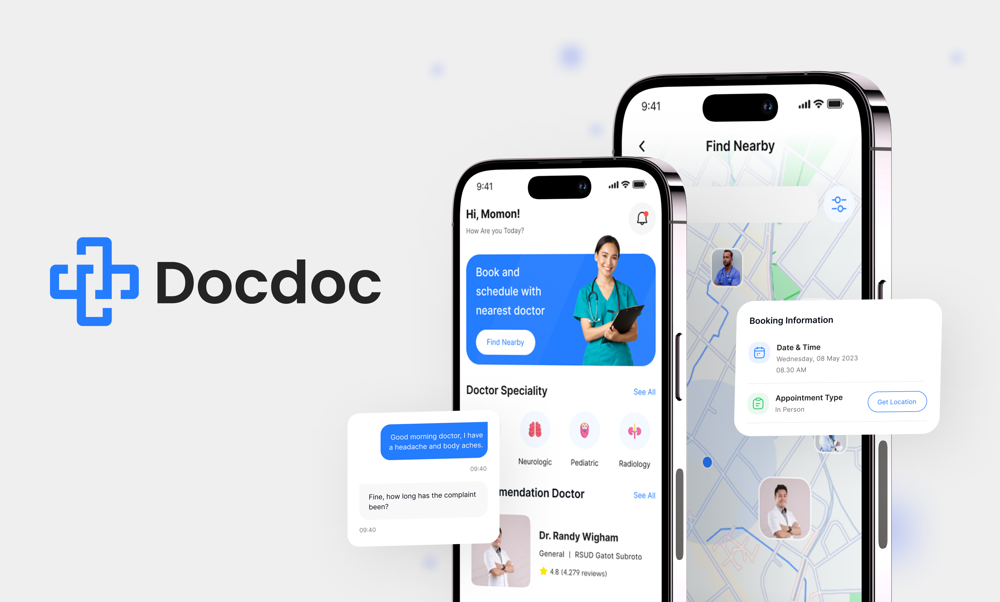

#  Docdoc

 

## Project Directory Structure

```
lib/
│
├── main.dart
├── doc_app.dart
│
├── core/
│   ├── di/
│   ├── helpers/
│   ├── networking/
│   ├── routing/
│   ├── theme/
│   ├── widgets/
│
├── features/
│   ├── feature/
│       ├── data/
│       ├── logic/
│       ├── ui/
```

## See also

 - [Figma design](https://www.figma.com/design/WB4GtMqCEZqJtuaWXd2oYd/Omar---Appointment-App?node-id=0-1&node-type=canvas)
 - [Api](https://documenter.getpostman.com/view/25727519/2s9YCBt9De#ec978e7a-e1fa-489c-97e7-4558ce601958)

